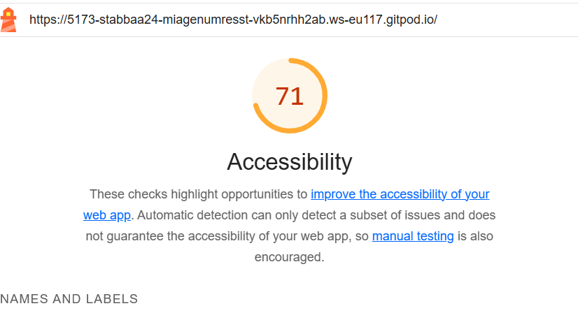

# Q1: Quels sont les arguments que vous pouvez utiliser pour convaincre votre Client de rendre son quizz accessible ? (Vous pouvez vous aider du cour)
Réponse:
Pour convaincre notre client de rendre son quiz accessible, voici les arguments que nous mettons en avant :
- Assurer l'égalité d'accès : Nous rendons le quiz accessible à tous, y compris aux personnes en situation de handicap, afin de garantir une égalité des chances et un accès équitable à l’information.
- Toucher un public plus large : En rendant le quiz accessible, nous élargissons notre audience potentielle, ce qui peut augmenter le trafic et les conversions sur le site.
- Respecter les normes légales : Nous nous assurons de respecter les standards d’accessibilité web, comme les WCAG 2.0 niveau AA, pour être en conformité avec les réglementations en vigueur.
- Améliorer l’image de marque : Nous montrons un engagement fort en faveur de l’inclusion, ce qui renforce notre réputation et attire une clientèle sensibilisée à ces valeurs.
- Optimiser la qualité technique : En intégrant l’accessibilité, nous améliorons la compatibilité du site avec divers appareils et navigateurs, ce qui garantit une expérience utilisateur optimale pour tous.

# Q2: Ajouter le screen de votre score :
Screen:

# Q3: Est-ce que l'analyse de Lighthouse est suffisante pour évaluer l'Accessibilité de votre Application ?
Réponse:
Bien que Lighthouse soit utile pour identifier certains problèmes d'accessibilité, il n'est pas suffisant pour une évaluation complète de l'accessibilité d'une application.
Il faudrait prendre en compte :
- Limitations des tests automatisés
- Aspects dynamiques
- Tests utilisateurs
- Couverture des directives WCAG

# Q4: Combien de fois vous devez utiliser une touche du clavier pour passer le quizz ?
Réponse:
Le nombre de clique pour arriver jusqu'au quizz est de 22.
En passant le quizz est jusqu'à l'évaluation on arrive à un total de 26 cliques. Sachant que j'ai répondu la 1ère proposition à chaque fois.

# Q5: Donner 3 roles ARIA et 3 propriété ARIA
Réponse:

# Q6: Ajouter le screen de votre score Lighthouse
Screen:

# Q7: L'une des best practice de l'ARIA est "ne pas utiliser l'ARIA" pouvez nous expliquer pourquoi d'après vous ?
Réponse:

# Q8: Ajouter le screen de votre score Lighthouse
Screen:

# Q9: Pourquoi le score de lighthouse n'a pas augmenté d'après vous ?
Réponse:

# Q10: Quel est la valeur du rapport de contraste actuel :
Réponse:

# Q11: Quel est la valeur du score AA :
Réponse:

# Q12: Quel est la valeur du score AAA :
Réponse:

# Q13: Comment pouvez vous changer la valeur du contraste de votre texte ?
Réponse:

# Q14: Ajouter le screen de votre score Lighthouse
Screen:

# Q15: Êtes vous capable de déterminer visuellement ce qui est un lien ou pas en appliquant chaque altérations ?
Réponse:

# Q16: Ajouter le screen de votre score Lighthouse
Screen:

# Q17:  Proposition 1
Description:
Nb d'actions gagnée : 

# Q18:  Proposition 2
Description:
Nb d'actions gagnée : 

# Q19:  Proposition 3
Description:
Nb d'actions gagnée : 
