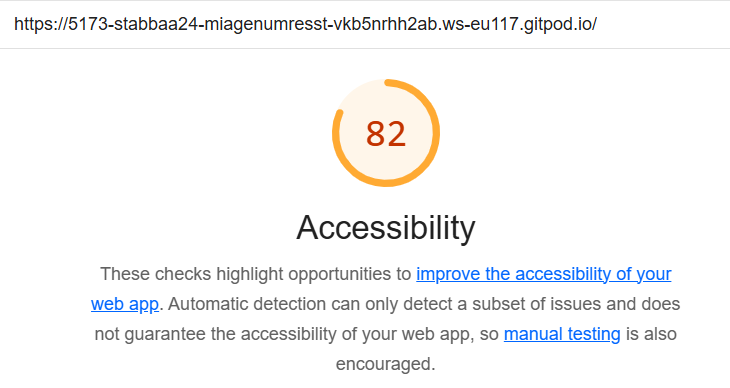
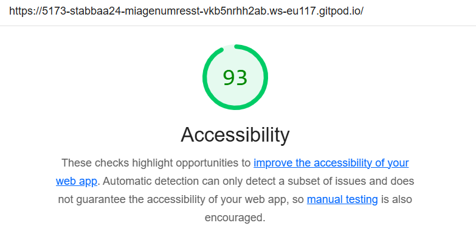
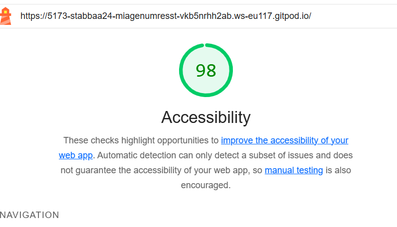
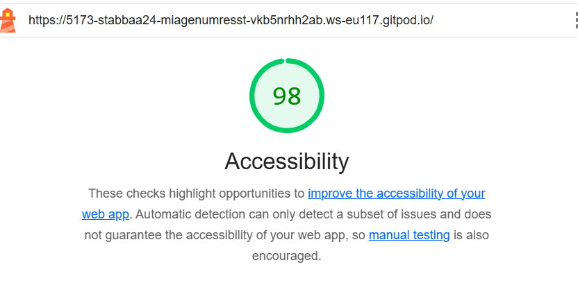

# Q1: Quels sont les arguments que vous pouvez utiliser pour convaincre votre Client de rendre son quizz accessible ? (Vous pouvez vous aider du cour)
Réponse:
Pour convaincre notre client de rendre son quiz accessible, voici les arguments que nous mettons en avant :
- Assurer l'égalité d'accès : Nous rendons le quiz accessible à tous, y compris aux personnes en situation de handicap, afin de garantir une égalité des chances et un accès équitable à l’information.
- Toucher un public plus large : En rendant le quiz accessible, nous élargissons notre audience potentielle, ce qui peut augmenter le trafic et les conversions sur le site.
- Respecter les normes légales : Nous nous assurons de respecter les standards d’accessibilité web, comme les WCAG 2.0 niveau AA, pour être en conformité avec les réglementations en vigueur.
- Améliorer l’image de marque : Nous montrons un engagement fort en faveur de l’inclusion, ce qui renforce notre réputation et attire une clientèle sensibilisée à ces valeurs.
- Optimiser la qualité technique : En intégrant l’accessibilité, nous améliorons la compatibilité du site avec divers appareils et navigateurs, ce qui garantit une expérience utilisateur optimale pour tous.

# Q2: Ajouter le screen de votre score :
Screen:

# Q3: Est-ce que l'analyse de Lighthouse est suffisante pour évaluer l'Accessibilité de votre Application ?
Réponse:
Bien que Lighthouse soit utile pour identifier certains problèmes d'accessibilité, il n'est pas suffisant pour une évaluation complète de l'accessibilité d'une application.
Il faudrait prendre en compte :
- Limitations des tests automatisés
- Aspects dynamiques
- Tests utilisateurs
- Couverture des directives WCAG

# Q4: Combien de fois vous devez utiliser une touche du clavier pour passer le quizz ?
Réponse:
Le nombre de clique pour arriver jusqu'au quizz est de 22.
En passant le quizz est jusqu'à l'évaluation on arrive à un total de 26 cliques. Sachant que j'ai répondu la 1ère proposition à chaque fois.

# Q5: Donner 3 roles ARIA et 3 propriété ARIA
Réponse:
## Rôles ARIA
- role="button" : Utilisé pour indiquer qu'un élément non traditionnel (comme une 
 ou ) doit être traité comme un bouton par les technologies d'assistance. Cela aide à fournir un contexte aux utilisateurs sur la fonctionnalité de l'élément.
- role="navigation" : Utilisé pour indiquer que l'élément contient une section de navigation principale du site, comme un menu ou des liens de barre de navigation. Cela aide les utilisateurs de lecteurs d'écran à identifier et à accéder rapidement aux zones de navigation du site.
- role="alert" : Utilisé pour marquer les messages importants et urgents qui doivent être immédiatement annoncés à l'utilisateur, sans attendre que ce dernier ne fasse quelque action. Cela garantit que les messages critiques sont reçus et compris par tous les utilisateurs, y compris ceux qui ont des limitations visuelles ou auditives.

## Propriétés ARIA
- aria-expanded="true|false" : Indique si le contenu associé à un élément, généralement utilisé avec des menus déroulants ou des options d'accordéon, est actuellement étendu (visible) ou non. Cela aide les utilisateurs à comprendre si l'action sur un élément révélera ou cachera des contenus associés.
- aria-hidden="true|false" : Utilisée pour informer les technologies d'assistance si un élément doit être rendu invisible ou non. Quand aria-hidden="true", l'élément et tous ses enfants sont cachés aux technologies d'assistance, ce qui peut être utile pour éviter la répétition ou cacher des éléments purement décoratifs qui ne sont pas pertinents pour les utilisateurs d'assistants.
- aria-label : Fournit une étiquette textuelle explicite pour des situations où une étiquette visuelle n'est pas suffisante. Par exemple, un bouton avec une icône mais sans texte peut avoir un aria-label pour clarifier sa fonction, comme aria-label="Fermer" pour un bouton représenté seulement par une croix.

# Q6: Ajouter le screen de votre score Lighthouse
Screen:

# Q7: L'une des best practice de l'ARIA est "ne pas utiliser l'ARIA" pouvez nous expliquer pourquoi d'après vous ?
Réponse:
La recommandation de "ne pas utiliser l'ARIA" vise à encourager l'utilisation du HTML sémantique, qui inclut nativement les rôles et propriétés ARIA. 
L'approche recommandée est de choisir des balises HTML appropriées pour chaque contenu et de recourir à ARIA uniquement quand le HTML ne suffit pas. Cela garantit une meilleure accessibilité et facilité de gestion du code.

# Q8: Ajouter le screen de votre score Lighthouse
Screen:

# Q9: Pourquoi le score de lighthouse n'a pas augmenté d'après vous ?
Réponse:
De base M. Mehdi pensait que le score n'allait pas augmenté... Pourtant il augmente car le site avait besoin d'amélioration html. (Question à ne pas répondre)

# Q10: Quel est la valeur du rapport de contraste actuel :
Réponse:
La valeur du rapport de constraste actuel est de : 2.38

# Q11: Quel est la valeur du score AA :
Réponse:
La valeur du score AA est de : 3.0

# Q12: Quel est la valeur du score AAA :
Réponse:
La valeur du score AAA est de : 4.5

# Q13: Comment pouvez vous changer la valeur du contraste de votre texte ?
Réponse:
- Choisir des couleurs de texte et de fond avec un contraste plus élevé
- Utiliser des outils de vérification de contraste
- Tester différents schémas de couleurs
- Augmenter la taille et l'épaisseur du texte

# Q14: Ajouter le screen de votre score Lighthouse
Screen:

# Q15: Êtes vous capable de déterminer visuellement ce qui est un lien ou pas en appliquant chaque altérations ?
Réponse:
Pour la question 
Oui, je peux évaluer visuellement ce qui est un lien et ce qui ne l'est pas après les modifications apportées. Cependant, pour les personnes ayant une vision floue ou un contraste réduit, il peut être difficile de distinguer les liens du reste du texte si le contraste n'est pas suffisamment élevé. En revanche, pour les types de daltonisme, l'application d'un schéma monochrome semble efficace, car cela permet d'uniformiser les couleurs tout en conservant les distinctions par luminosité, facilitant ainsi la perception des différents éléments interactifs.

# Q16: Ajouter le screen de votre score Lighthouse
Screen:

# Q17:  Proposition 1
Description: Utilisation de aria-live pour les Feedbacks Automatiques pour annoncer automatiquement les changements sur la page comme les résultats du quiz ou les modifications de questions sans action

Nb d'actions gagnée : 0 car concentration non sur le nb d'actions.

# Q18:  Proposition 2
Description: Mettre le quizz au départ le page afin de directement y accéder. On aurait donc 2 cliques pour y arriver (le 1er est pour accéder à la page à propos).

Nb d'actions gagnée : On passe de 22 à 2 cliques

# Q19:  Proposition 3
Description: Mettre un lien caché au tout début avec écrit *accéder aux quizz* comme ceci en 1 clique on arrive au quizz

Nb d'actions gagnée : 22 à 1

# Q19:  Proposition 4
Description: Rendre tous le site avec une voix oral mais qui explique bien chaque clique donc pas juste clique ici, on veut aussi entendre les questions, les réponses donc réponses 1, 2... Puis la réponse qui a été choisi

Nb d'actions gagnée : 
