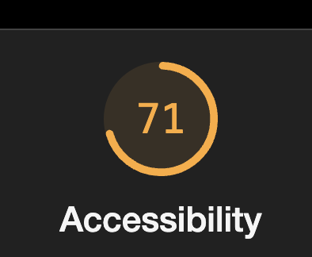
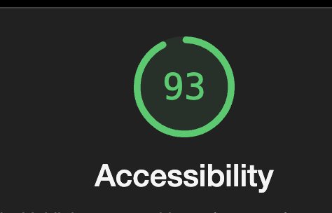
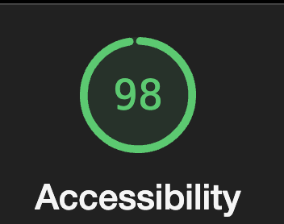

# Q1: Quels sont les arguments que vous pouvez utiliser pour convaincre votre Client de rendre son quizz accessible ? (Vous pouvez vous aider du cour)
Réponse :

- Obligation Légale : Respecter les lois sur l'accessibilité pour éviter des sanctions.
- Audience élargie : Toucher une population incluant les personnes en situation de handicap.
- Image positive : Montrer un engagement pour l'inclusion et la responsabilité sociale.
- SEO amélioré : Les pratiques d'accessibilité renforcent le référencement naturel.
- Avantage concurrentiel : Se démarquer avec une application inclusive.

# Q2: Ajouter le screen de votre score :
Screen:

# Q3: Est-ce que l'analyse de Lighthouse est suffisante pour évaluer l'Accessibilité de votre Application ?
Réponse:
Non, l'analyse de Lighthouse n'est pas suffisante. Bien qu'elle fournisse des indicateurs utiles (comme le score actuel de 71, visible sur l'image ci-dessus), elle ne détecte pas tous les problèmes d'accessibilité. Certains aspects, comme la qualité des descriptions, l'ergonomie ou la navigation au clavier, nécessitent une validation humaine. Un audit manuel reste indispensable pour garantir une accessibilité complète.

# Q4: Combien de fois vous devez utiliser une touche du clavier pour passer le quizz ?
Réponse:
31 tabs

# Q5: Donner 3 roles ARIA et 3 propriété ARIA
Réponse :

3 rôles ARIA :
- role="button" : Définit un élément comme un bouton interactif.
- role="alert" : Utilisé pour les messages d'alerte qui nécessitent une attention immédiate.
- role="navigation" : Indique une zone contenant des liens de navigation.

3 propriétés ARIA :
- aria-label : Fournit un nom accessible pour un élément interactif.
- aria-hidden="true" : Masque un élément aux technologies d'assistance.
- aria-live="polite" : Annonce dynamiquement les mises à jour de contenu sans interrompre l'utilisateur.

# Q6: Ajouter le screen de votre score Lighthouse
Screen:

# Q7: L'une des best practice de l'ARIA est "ne pas utiliser l'ARIA" pouvez nous expliquer pourquoi d'après vous ?
Réponse:
L'une des meilleures pratiques de l'ARIA est "ne pas utiliser l'ARIA" car, lorsque les éléments HTML sémantiques natifs sont correctement utilisés (comme `<button>`, `<nav>`, `<header>`), ils intègrent déjà les rôles et propriétés nécessaires pour les technologies d'assistance. Ajouter des attributs ARIA inutiles peut entraîner des comportements imprévus ou des redondances, rendant le site moins accessible. ARIA doit être utilisé uniquement lorsqu'il n'existe pas d'équivalent natif en HTML.

# Q8: Ajouter le screen de votre score Lighthouse
Screen:

# Q9: Pourquoi le score de lighthouse n'a pas augmenté d'après vous ?
Réponse:
Le score de Lighthouse n'a pas augmenté car les modifications apportées ne couvrent pas tous les critères d'accessibilité. Par exemple :

- Les problèmes liés à la navigation clavier ou au focus peuvent persister.
- Des rôles ARIA inutiles ou mal utilisés peuvent entraîner des conflits.
- Le contraste des couleurs et les alternatives textuelles peuvent ne pas être complètement optimisés.
- Les balises HTML sémantiques doivent être correctement intégrées et testées pour s'assurer qu'elles sont reconnues par les technologies d'assistance.

# Q10: Quel est la valeur du rapport de contraste actuel :
Réponse:
Contrast ration : 2.38

# Q11: Quel est la valeur du score AA :
Réponse:
- Pour le texte normal, la valeur minimale pour AA est 4.5:1.
- Pour un texte large (au moins 18px ou 14px en gras), le score AA est 3:1.

# Q12: Quel est la valeur du score AAA :
Réponse:
- Pour le texte normal, la valeur minimale pour AAA est 7:1.
- Pour un texte large, le score AAA est 4.5:1.

# Q13: Comment pouvez vous changer la valeur du contraste de votre texte ?
Réponse:
- Changer la couleur du texte (color) pour une teinte plus sombre ou plus claire selon le fond.
- Modifier la couleur de l'arrière-plan (background-color) pour qu'elle contraste davantage avec le texte.
- Augmenter l'épaisseur de la police (bold) pour améliorer la lisibilité si le contraste est limite.

# Q14: Ajouter le screen de votre score Lighthouse
Screen:

# Q15: Êtes vous capable de déterminer visuellement ce qui est un lien ou pas en appliquant chaque altérations ?
Réponse:
OUI

# Q16: Ajouter le screen de votre score Lighthouse
Screen:

# Q17:  Proposition 1
Description:
Nb d'actions gagnée : 

# Q18:  Proposition 2
Description:
Nb d'actions gagnée : 

# Q19:  Proposition 3
Description:
Nb d'actions gagnée : 
