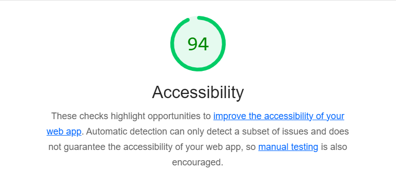
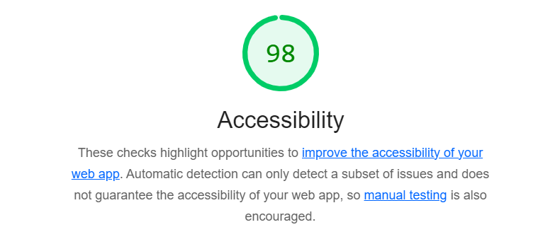

# Q1: Quels sont les arguments que vous pouvez utiliser pour convaincre votre Client de rendre son quizz accessible ? (Vous pouvez vous aider du cour)
Réponse:
Pour plusieurs raisons:

Dans de nombreux pays, l’accessibilité numérique est une obligation légal
Par responsabilité sociale
Augmentation légère de la portée et de l'audience
 Amélioration du référencement et de la performance
# Q2: Ajouter le screen de votre score :
Screen:

# Q3: Est-ce que l'analyse de Lighthouse est suffisante pour évaluer l'Accessibilité de votre Application ?
Réponse:

Il est essentiel de réaliser des tests manuels pour valider l’expérience utilisateur.

# Q4: Combien de fois vous devez utiliser une touche du clavier pour passer le quizz ?
Réponse:
31 fois
# Q5: Donner 3 roles ARIA et 3 propriété ARIA
Réponse:

3 rôles ARIA
role="button" : Indique un bouton interactif.
role="alert" : Message prioritaire immédiatement annoncé.
role="dialog" : Définit une boîte de dialogue.

3 propriétés ARIA
aria-label : Étiquette accessible d’un élément.
aria-hidden : Cache un élément des lecteurs d’écran.
aria-expanded : Indique l’état (développé/replié) d’un élément.

# Q6: Ajouter le screen de votre score Lighthouse
Screen:

# Q7: L'une des best practice de l'ARIA est "ne pas utiliser l'ARIA" pouvez nous expliquer pourquoi d'après vous ?
Réponse:
Raisons :
HTML natif est accessible : Les éléments comme <button> sont déjà interprétés correctement par les technologies d'assistance.
Risque d'erreurs : L'usage incorrect de l'ARIA peut créer des conflits ou casser l'accessibilité.
Maintenance accrue : ARIA nécessite plus de code et augmente les risques d’erreurs.

# Q8: Ajouter le screen de votre score Lighthouse
Screen:

# Q9: Pourquoi le score de lighthouse n'a pas augmenté d'après vous ?
Réponse:

 Les modifications apportées concernent surtout la structure HTML et l'accessibilité, mais elles n'ont pas nécessairement amélioré les performances du site (temps de chargement, taille des ressources, etc.)

# Q10: Quel est la valeur du rapport de contraste actuel :
Réponse:
Le rapport de contraste est de 2.38
# Q11: Quel est la valeur du score AA :
Réponse:
Pour obtenir un score AA, le rapport de contraste doit être au minimum de 4.5:1 pour les textes normaux et 3:1 pour les textes larges

# Q12: Quel est la valeur du score AAA :
Réponse:
 Pour le contraste, la valeur minimale recommandée est de 7:1 pour le texte normal et 4.5:1 pour le texte large
# Q13: Comment pouvez vous changer la valeur du contraste de votre texte ?
Réponse:
En donnant une couleur plus éloignée dans le spectre des couleurs aux textes

# Q14: Ajouter le screen de votre score Lighthouse
Screen:

# Q15: Êtes vous capable de déterminer visuellement ce qui est un lien ou pas en appliquant chaque altérations ?
Réponse:
oui

# Q16: Ajouter le screen de votre score Lighthouse
Screen:

# Q17:  Proposition 1
Description:Lorsqu'un changement dynamique survient sur la page, il peut être crucial pour l'utilisateur, en particulier pour les utilisateurs de lecteurs d'écran, de savoir immédiatement que quelque chose a changé.
Nb d'actions gagnée : 

# Q18:  Proposition 2
Description:
Nb d'actions gagnée : 

# Q19:  Proposition 3
Description:
Nb d'actions gagnée : 
