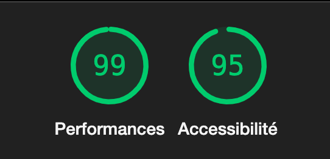

# Q1: Quels sont les arguments que vous pouvez utiliser pour convaincre votre Client de rendre son quizz accessible ? (Vous pouvez vous aider du cour)
Réponse:
Égalité d’accès : Permet à tous (personnes en situation de handicap, personnes âgées, environnements contraignants) de profiter des services numériques.

Impact économique : Augmente le trafic et les conversions sur un site en touchant un public plus large.

# Q2: Ajouter le screen de votre score :
Screen:

# Q3: Est-ce que l'analyse de Lighthouse est suffisante pour évaluer l'Accessibilité de votre Application ?
Réponse:
L’analyse de Lighthouse est un bon point de départ pour évaluer l’accessibilité d’une application, mais elle est insuffisante à elle seule. Elle détecte des problèmes courants (contrastes, balises <alt> manquantes) mais ne peut pas évaluer les interactions complexes ou le contexte des contenus. Pour une évaluation complète, il faut compléter avec des tests manuels (lecteurs d’écran, navigation clavier) et des retours d’utilisateurs en situation réelle.

# Q4: Combien de fois vous devez utiliser une touche du clavier pour passer le quizz ?
Réponse:
22

# Q5: Donner 3 roles ARIA et 3 propriété ARIA
Réponse:
3 Rôles ARIA :
role="button" : Définit un élément comme un bouton interactif.
role="dialog" : Désigne une boîte de dialogue ou une fenêtre modale.
role="navigation" : Identifie une section de la page servant à la navigation.
3 Propriétés ARIA :
aria-label : Fournit une étiquette accessible à un élément (utile si l’élément n’a pas de texte visible).
aria-hidden : Indique si un élément doit être ignoré par les technologies d’assistance.
aria-expanded : Indique l’état de déploiement d’un élément (par exemple, pour un menu ou un accordéon).

# Q6: Ajouter le screen de votre score Lighthouse
Screen:

# Q7: L'une des best practice de l'ARIA est "ne pas utiliser l'ARIA" pouvez nous expliquer pourquoi d'après vous ?
Réponse:
La meilleure pratique "ne pas utiliser l'ARIA" signifie qu'il faut privilégier les éléments HTML natifs (comme <button>, <nav>, <label>, etc.) avant d'ajouter des attributs ARIA. Cela s’explique par plusieurs raisons :

HTML natif est accessible par défaut : Les éléments HTML standards intègrent déjà des fonctionnalités accessibles compatibles avec les technologies d’assistance.
ARIA mal utilisée peut nuire : Une mauvaise utilisation d’ARIA peut créer des problèmes d’accessibilité (par exemple, des informations contradictoires pour les lecteurs d’écran).
Simplicité et maintenance : Utiliser des éléments HTML natifs rend le code plus simple, plus compréhensible et plus facile à maintenir.
L'ARIA doit être utilisée uniquement en complément lorsque le HTML seul ne permet pas d’assurer une accessibilité complète.

# Q8: Ajouter le screen de votre score Lighthouse
Screen:

# Q9: Pourquoi le score de lighthouse n'a pas augmenté d'après vous ?
Réponse:
Du coup si

# Q10: Quel est la valeur du rapport de contraste actuel :
Réponse:

# Q11: Quel est la valeur du score AA :
Réponse:

# Q12: Quel est la valeur du score AAA :
Réponse:

# Q13: Comment pouvez vous changer la valeur du contraste de votre texte ?
Réponse:

Pour changer la valeur du contraste du texte, vous pouvez :

Modifier la couleur du texte (color) :

Utiliser une couleur plus foncée ou plus claire en fonction de la couleur de fond.
Modifier la couleur d’arrière-plan (background-color) :

Adopter une couleur qui crée un contraste suffisant avec le texte.
Utiliser des outils de vérification de contraste :

Outils comme WebAIM Contrast Checker ou Lighthouse pour s’assurer que le ratio de contraste respecte les normes d’accessibilité (WCAG AA ou AAA).

# Q14: Ajouter le screen de votre score Lighthouse
Screen:

# Q15: Êtes vous capable de déterminer visuellement ce qui est un lien ou pas en appliquant chaque altérations ?
Réponse:
Non, pas toujours

# Q16: Ajouter le screen de votre score Lighthouse
Screen:

# Q17:  Proposition 1
Proposition 1 : Utiliser aria-live="assertive"
L’attribut aria-live="assertive" permet d'informer immédiatement les utilisateurs de lecteurs d'écran des changements critiques, comme des messages d’erreur ou des notifications importantes. Cela élimine la nécessité pour l'utilisateur de chercher manuellement ces informations sur la page. Par exemple, lorsqu’une erreur survient lors d’un formulaire, le message est automatiquement lu, offrant une expérience plus fluide et accessible.

# Q18:  Proposition 2
Proposition 2 : Utiliser focus() pour guider l'utilisateur
En utilisant focus() pour déplacer le focus sur un élément clé (comme une nouvelle section ou un contenu chargé dynamiquement), l'utilisateur est directement guidé vers la zone pertinente. Cela supprime la nécessité de naviguer manuellement pour trouver les informations importantes, améliorant ainsi l'expérience utilisateur, notamment pour les personnes utilisant des technologies d’assistance.

# Q19:  Proposition 3
Proposition 3 : Utiliser aria-live="polite"
L’attribut aria-live="polite" est idéal pour notifier les utilisateurs de changements non urgents, comme des mises à jour de statut ou des informations secondaires (ex. : "Chargement terminé"). Cela permet de transmettre les informations de manière non intrusive, sans interrompre les interactions en cours, tout en assurant que les mises à jour soient accessibles et compréhensibles.