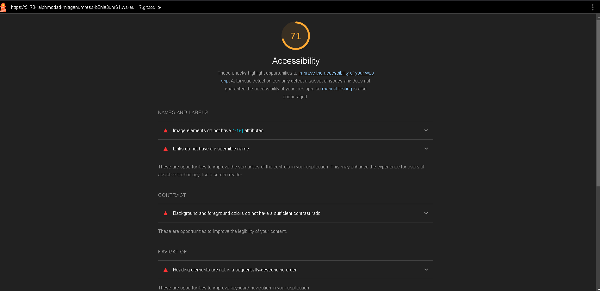
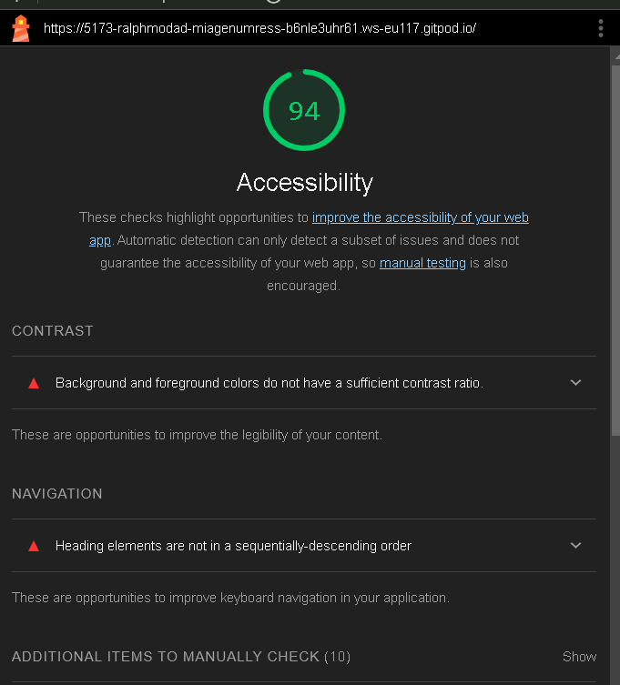
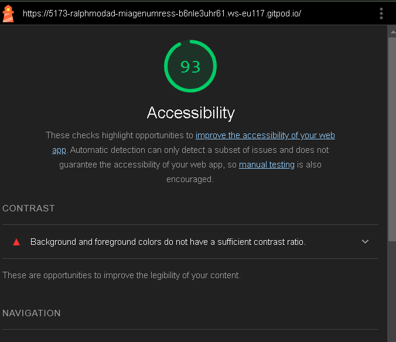
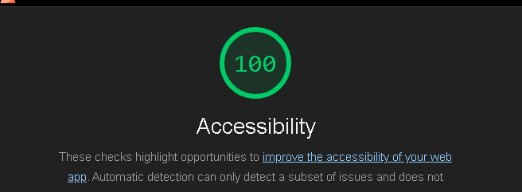

# Q1: Quels sont les arguments que vous pouvez utiliser pour convaincre votre Client de rendre son quizz accessible ? (Vous pouvez vous aider du cour)
Réponse:
- Améliorer l'accessibilité de votre site web peut augmenter votre audience et votre clientèle. En effet, les personnes ayant des besoins spécifiques sont souvent exclues de l'accès à l'information et aux services en ligne. En rendant votre site web accessible, vous pouvez attirer un public plus large et augmenter votre clientèle.

# Q2: Ajouter le screen de votre score :
Screen:

# Q3: Est-ce que l'analyse de Lighthouse est suffisante pour évaluer l'Accessibilité de votre Application ?
Réponse:
Non, l'analyse de Lighthouse n'est pas suffisante pour évaluer l'accessibilité de l'application. En effet, Lighthouse ne couvre pas tous les aspects de l'accessibilité, et il est important de réaliser des tests manuels pour s'assurer que l'application est accessible à tous les utilisateurs, y compris ceux ayant des besoins spécifiques.

# Q4: Combien de fois vous devez utiliser une touche du clavier pour passer le quizz ?
Réponse: il faut utiliser 30 fois avec tab pour passer le quizz et les bonnes réponses.

# Q5: Donner 3 roles ARIA et 3 propriété ARIA
Réponse:
- Roles ARIA:
    1. `role="button"` : Indique qu'un élément est un bouton.
    2. `role="navigation"` : Indique qu'un élément est une section de navigation.
    3. `role="alert"` : Indique qu'un élément est une alerte.

- Propriétés ARIA:
    1. `aria-label` : Fournit une étiquette accessible pour un élément.
    2. `aria-hidden` : Indique qu'un élément est caché aux technologies d'assistance.
    3. `aria-expanded` : Indique si un élément, tel qu'un menu ou une section, est actuellement étendu ou replié.
Réponse:

# Q6: Ajouter le screen de votre score Lighthouse
Screen:

# Q7: L'une des best practice de l'ARIA est "ne pas utiliser l'ARIA" pouvez nous expliquer pourquoi d'après vous ?
Réponse:
L'une des meilleures pratiques de l'ARIA est de ne pas l'utiliser lorsque ce n'est pas nécessaire. En effet, les éléments HTML natifs sont déjà accessibles et supportés par les technologies d'assistance. Utiliser ARIA de manière incorrecte peut introduire des problèmes d'accessibilité supplémentaires. Il est donc recommandé de s'appuyer sur les éléments HTML natifs autant que possible et de n'utiliser ARIA que lorsque cela est absolument nécessaire pour améliorer l'accessibilité.

# Q8: Ajouter le screen de votre score Lighthouse
Screen:

# Q9: Pourquoi le score de lighthouse n'a pas augmenté d'après vous ?
Réponse:
Le score de Lighthouse n'a pas augmenté car il y a encore des problèmes d'accessibilité non résolus sur le site web. Il est important de corriger tous les problèmes d'accessibilité identifiés par Lighthouse pour améliorer le score et rendre le site web accessible à tous les utilisateurs.Meme au niveau des couleurs, il y a des problèmes de contraste qui n'ont pas été résolus.

# Q10: Quel est la valeur du rapport de contraste actuel :
Réponse:
pas ouf 2.38
# Q11: Quel est la valeur du score AA :
Réponse:
3.0

# Q12: Quel est la valeur du score AAA :
Réponse:4.5

# Q13: Comment pouvez vous changer la valeur du contraste de votre texte ?
Réponse:just een mettant du blanc 181 181 181 sur le texte 

# Q14: Ajouter le screen de votre score Lighthouse
Screen:

# Q15: Êtes vous capable de déterminer visuellement ce qui est un lien ou pas en appliquant chaque altérations ?
Réponse: oui je suis capable de déterminer visuellement ce qui est un lien ou pas en appliquant chaque altérations.

# Q16: Ajouter le screen de votre score Lighthouse
Screen:

# Q17:  Proposition 1
Description:
Nb d'actions gagnée : 

# Q18:  Proposition 2
Description:
Nb d'actions gagnée : 

# Q19:  Proposition 3
Description:
Nb d'actions gagnée : 
