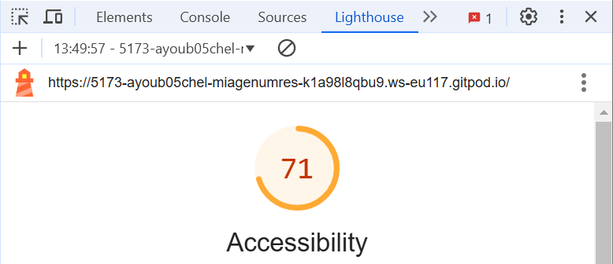
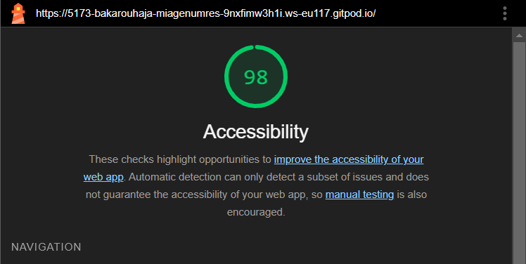
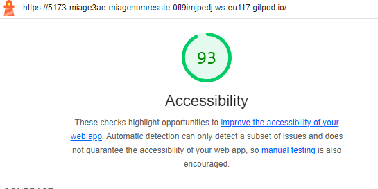
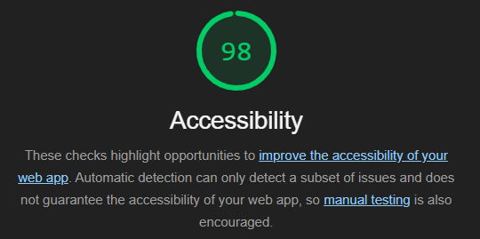
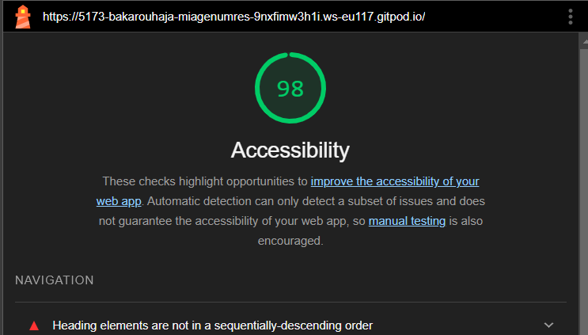

# Q1: Quels sont les arguments que vous pouvez utiliser pour convaincre votre Client de rendre son quizz accessible ? (Vous pouvez vous aider du cour)
Réponse: 
rendre le quizz plus accessible augmentra le nombre d'utilisateurs potentiels, et permettra à des utilisateurs avec des besoins particuliers à pouvoir faire le quizz 

# Q2: Ajouter le screen de votre score :
Screen:

# Q3: Est-ce que l'analyse de Lighthouse est suffisante pour évaluer l'Accessibilité de votre Application ?
Réponse: non, l'analyse de lighthouse n'est pas suffisante pour évaluer l'accessibilité de notre application

# Q4: Combien de fois vous devez utiliser une touche du clavier pour passer le quizz ?
Réponse: 22 touches

# Q5: Donner 3 roles ARIA et 3 propriété ARIA
Réponse:

Rôles ARIA (Accessible Rich Internet Applications) :
role="button" : Désigne un élément interactif qui agit comme un bouton.
role="alert" : Signale une alerte importante à l'utilisateur, souvent utilisée pour afficher des messages d'erreur ou des notifications.
role="navigation" : Définit une région de navigation, comme un menu ou une barre de navigation.
Propriétés ARIA :
aria-label : Fournit une étiquette textuelle personnalisée pour un élément, utile pour les lecteurs d'écran.
aria-hidden : Indique si un élément est visible ou non aux technologies d'assistance.
aria-expanded : Signale l'état (étendu ou réduit) d'un composant interactif comme un menu ou un accordéon.

# Q6: Ajouter le screen de votre score Lighthouse
Screen:

# Q7: L'une des best practice de l'ARIA est "ne pas utiliser l'ARIA" pouvez nous expliquer pourquoi d'après vous ?
Réponse: il faut previligié l'écriture du code html sémantique qui consiste à utiliser des éléments TML pour structurer le contenu en fonction de chaque élément et non de son apparence

# Q8: Ajouter le screen de votre score Lighthouse
Screen:

# Q9: Pourquoi le score de lighthouse n'a pas augmenté d'après vous ?
Réponse:

# Q10: Quel est la valeur du rapport de contraste actuel :
Réponse:
2.38

# Q11: Quel est la valeur du score AA :
Réponse: AA:3.0

# Q12: Quel est la valeur du score AAA :
Réponse:
AAA: 4.5

# Q13: Comment pouvez vous changer la valeur du contraste de votre texte ?
Réponse: changer la couleur du texte ou changer la couleur du background

# Q14: Ajouter le screen de votre score Lighthouse
Screen:

# Q15: Êtes vous capable de déterminer visuellement ce qui est un lien ou pas en appliquant chaque altérations ?
Réponse: oui

# Q16: Ajouter le screen de votre score Lighthouse
Screen:

# Q17:  Proposition 1
Description:
Nb d'actions gagnée : 

# Q18:  Proposition 2
Description:
Nb d'actions gagnée : 

# Q19:  Proposition 3
Description:
Nb d'actions gagnée : 
