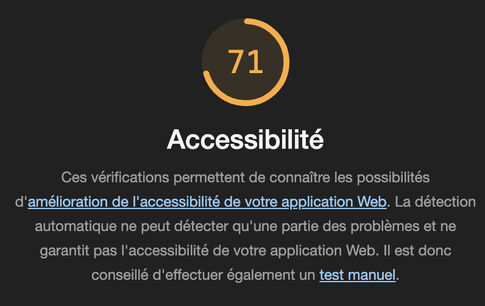
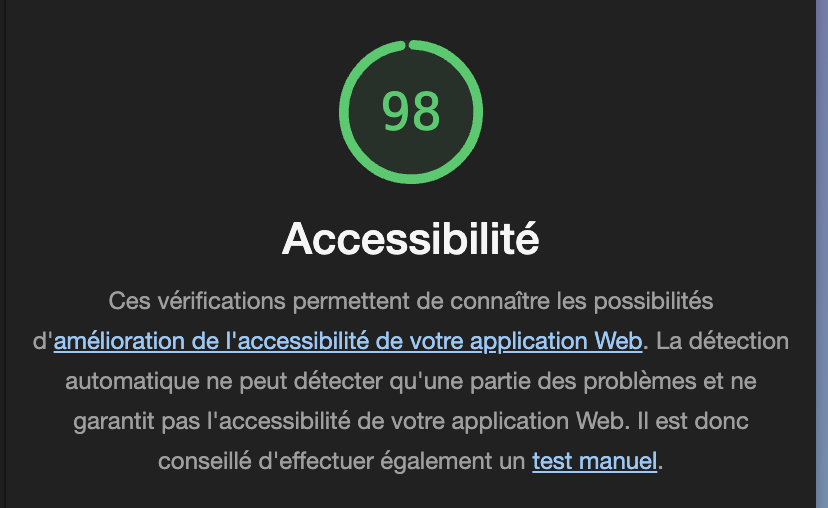
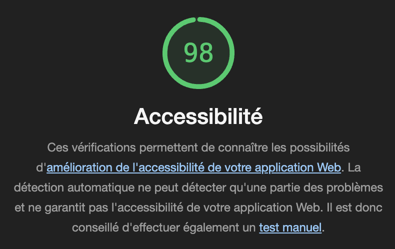

# Q1: Quels sont les arguments que vous pouvez utiliser pour convaincre votre Client de rendre son quizz accessible ? (Vous pouvez vous aider du cour)
Réponse:
Audience élargie : Accessible à tous, y compris les personnes en situation de handicap.  
Image positive : Valorise l’engagement inclusif et responsable de la marque.  
Meilleure expérience utilisateur : Profite à tous grâce à une navigation claire et intuitive.  
Engagement éthique : Favorise l’inclusivité et le respect des droits.  

# Q2: Ajouter le screen de votre score :
Screen:  

# Q3: Est-ce que l'analyse de Lighthouse est suffisante pour évaluer l'Accessibilité de votre Application ?
Réponse: Non, l'analyse de Lighthouse n'est pas suffisante. Elle détecte uniquement les problèmes automatiques. Une évaluation complète nécessite des tests manuels pour identifier les problèmes complexes non détectés automatiquement.

# Q4: Combien de fois vous devez utiliser une touche du clavier pour passer le quizz ?
Réponse: 31 

# Q5: Donner 3 roles ARIA et 3 propriété ARIA
Réponse:

rôles ARIA :  
- - role="button" : Indique qu’un élément agit comme un bouton.  
role="alert" : Utilisé pour afficher un message important à l’utilisateur.  
- role="navigation" : Définit une région de navigation pour faciliter l’accès aux menus.  

propriétés ARIA :  
- aria-label : Fournit une étiquette accessible pour un élément.  
- aria-hidden="true" : Indique que l’élément est caché aux technologies d’assistance.  
- aria-expanded="false/true" : Signale si un élément, comme un menu déroulant, est replié ou étendu.  

# Q6: Ajouter le screen de votre score Lighthouse
Screen: 

# Q7: L'une des best practice de l'ARIA est "ne pas utiliser l'ARIA" pouvez nous expliquer pourquoi d'après vous ?
Réponse: 
La best practice "ne pas utiliser l'ARIA" s'explique par :  

- HTML natif : Les éléments HTML sémantiques sont naturellement accessibles.  
- Complexité : Une mauvaise utilisation d’ARIA peut créer des erreurs.  
- Compatibilité : Les navigateurs et lecteurs d’écran gèrent mieux le HTML standard.  

# Q8: Ajouter le screen de votre score Lighthouse
Screen: Screen: 

# Q10: Quel est la valeur du rapport de contraste actuel :
Réponse:

# Q11: Quel est la valeur du score AA :
Réponse:

# Q12: Quel est la valeur du score AAA :
Réponse:

# Q13: Comment pouvez vous changer la valeur du contraste de votre texte ?
Réponse:

# Q14: Ajouter le screen de votre score Lighthouse
Screen:

# Q15: Êtes vous capable de déterminer visuellement ce qui est un lien ou pas en appliquant chaque altérations ?
Réponse:

# Q16: Ajouter le screen de votre score Lighthouse
Screen:

# Q17:  Proposition 1
Description:
Nb d'actions gagnée : 

# Q18:  Proposition 2
Description:
Nb d'actions gagnée : 

# Q19:  Proposition 3
Description:
Nb d'actions gagnée :