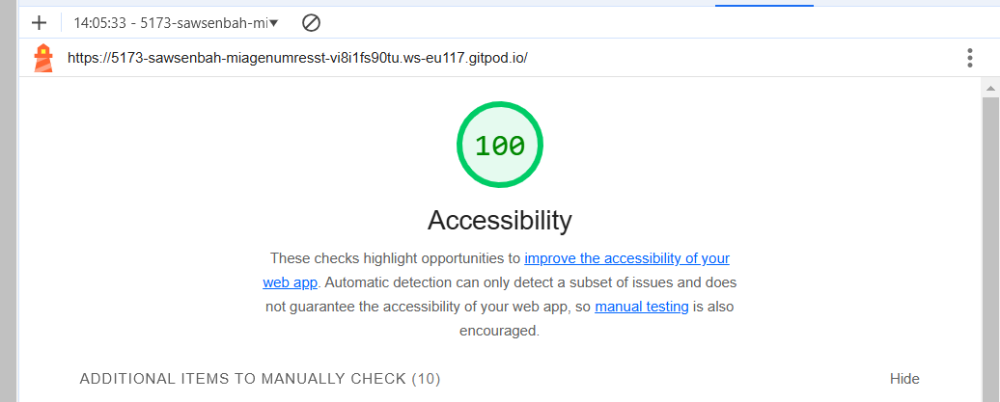

# Q1: Quels sont les arguments que vous pouvez utiliser pour convaincre votre Client de rendre son quizz accessible ? (Vous pouvez vous aider du cour)
Réponse:
Conformité légale : Respect des normes (RGAA, ADA) pour éviter sanctions et litiges.
Public élargi : Accessibilité pour les personnes en situation de handicap, augmentant le nombre d'utilisateurs.
Image positive : Valorisation de la responsabilité sociale et de l’inclusion.
Meilleure expérience : Amélioration pour tous les utilisateurs grâce à des interfaces claires et ergonomiques.

# Q2: Ajouter le screen de votre score :
Screen:

# Q3: Est-ce que l'analyse de Lighthouse est suffisante pour évaluer l'Accessibilité de votre Application ?
Réponse:Non, Lighthouse ne suffit pas. Il détecte des problèmes basiques, mais une vérification manuelle est nécessaire pour tester la navigation au clavier, les lecteurs d’écran et d’autres aspects complexes.

# Q4: Combien de fois vous devez utiliser une touche du clavier pour passer le quizz ?
Réponse:Il faut 30 appuis sur la touche Tab pour passer le quizz.

# Q5: Donner 3 roles ARIA et 3 propriété ARIA
Réponse:
3 rôles ARIA :
role="button" : Définit un élément comme un bouton interactif.
role="alert" : Indique un message d’alerte qui doit être immédiatement annoncé par les lecteurs d’écran.
role="heading" : Déclare un élément comme un titre avec un niveau spécifique (ex : aria-level="1")

3 propriétés ARIA :
aria-label : Donne une étiquette textuelle à un élément sans contenu visible.
aria-hidden : Indique si un élément doit être ignoré par les technologies d’assistance (true ou false).
aria-live : Informe que le contenu d’un élément doit être mis à jour dynamiquement et annoncé par les lecteurs d’écran 

# Q6: Ajouter le screen de votre score Lighthouse
Screen: Screen:

# Q7: L'une des best practice de l'ARIA est "ne pas utiliser l'ARIA" pouvez nous expliquer pourquoi d'après vous ?
reponse : L’ARIA doit être utilisée seulement si les éléments HTML sémantiques ne suffisent pas.

Pour moi, cela s'explique car :

HTML sémantique est naturellement accessible : Les balises comme <header>, <section>, <button> et <h1> possèdent déjà des rôles ARIA par défaut.
et Un mauvais usage de l’ARIA peut nuire à l’accessibilité.

# Q8: Ajouter le screen de votre score Lighthouse
Screen:  Screen:

# Q9: Pourquoi le score de lighthouse n'a pas augmenté d'après vous ?
Réponse: le score a changé vu que ça change l 'hircherarchie de mon code HTML ( ça permet au reader d'identifier quoi lire en premier )

# Q10: Quel est la valeur du rapport de contraste actuel :
Réponse:   Screen:

# Q11 et 12: Quel est la valeur du score AA :
Réponse:  Screen:

# Q13: Comment pouvez vous changer la valeur du contraste de votre texte ?
Réponse:Je change la couleur du texte (color) et du fond (background-color) dans le CSS.

# Q14: Ajouter le screen de votre score Lighthouse
Screen: Screen:

# Q15: Êtes vous capable de déterminer visuellement ce qui est un lien ou pas en appliquant chaque altérations ?
Réponse:Non, il est difficile de déterminer ce qui est un lien avec certaines altérations visuelles comme le flou ou troubles ....

# Q16: Ajouter le screen de votre score Lighthouse
Screen: Screen:

# Q17:  Proposition 1
Description:
Nb d'actions gagnée : 

# Q18:  Proposition 2
Description:
Nb d'actions gagnée : 

# Q19:  Proposition 3
Description:
Nb d'actions gagnée : 
