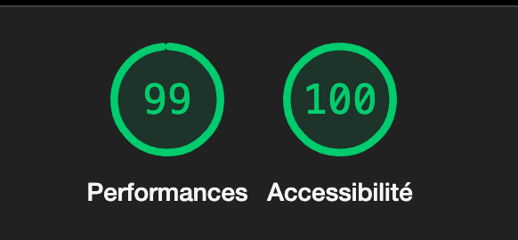

# Q1: Quels sont les arguments que vous pouvez utiliser pour convaincre votre Client de rendre son quizz accessible ? (Vous pouvez vous aider du cour)
Réponse: - Égalité d’accès et opportunité : L’accessibilité offre une égalité d’accès à l’information et des opportunités équitables à tous les utilisateurs, y compris ceux en situation de handicap.
- Augmentation du trafic et des conversions : En rendant l'application accessible, vous touchez un public plus large, ce qui peut augmenter le trafic et les conversions sur le site.
- Conformité légale : De nombreux pays imposent des standards d’accessibilité numérique (par exemple, les normes WCAG 2.0 avec un niveau de conformité minimum AA recommandé par l’Union européenne).
- Amélioration de l’expérience utilisateur : Les meilleures pratiques d’accessibilité, comme un bon contraste, profitent à tous les utilisateurs, pas seulement à ceux avec des besoins spécifiques.
- Compatibilité avec les futurs logiciels : En suivant les normes, votre application sera compatible avec les outils et technologies actuels et futurs.

# Q2: Ajouter le screen de votre score :
Screen:

# Q3: Est-ce que l'analyse de Lighthouse est suffisante pour évaluer l'Accessibilité de votre Application ?
Réponse:
Non, l’analyse de Lighthouse n’est pas suffisante pour évaluer complètement l’accessibilité. Voici pourquoi :

- Limites des outils automatisés : Lighthouse ne détecte que des problèmes mesurables automatiquement (par exemple, contraste, balises alt manquantes). Les problèmes plus contextuels nécessitent des tests humains.
- Tests utilisateurs nécessaires : Les tests manuels, comme l’utilisation de lecteurs d’écran (ex. VoiceOver, NVDA) ou des scénarios d’interaction réels, sont indispensables pour garantir une accessibilité optimale.
- Vérification des interactions : Lighthouse ne teste pas directement la navigation clavier ou les interactions dynamiques complexes.

# Q4: Combien de fois vous devez utiliser une touche du clavier pour passer le quizz ?
Réponse:
Il faut utiliser 33 fois une touche du clavier pour compléter le quizz.

# Q5: Donner 3 roles ARIA et 3 propriété ARIA
Réponse:
3 rôles ARIA :

- role="button" : Définit un élément comme un bouton interactif, même s’il ne s’agit pas d’un élément HTML <button>.
- role="alert" : Indique une région destinée à afficher des messages d’alerte, qui doivent être immédiatement annoncés par les lecteurs d’écran.
- role="navigation" : Utilisé pour identifier une section de navigation sur une page web.

3 propriétés ARIA :

- aria-label : Fournit une description textuelle à un élément interactif ou graphique.
- aria-hidden : Indique qu’un élément est masqué pour les technologies d’assistance comme les lecteurs d’écran.
- aria-live : Définit la manière dont un lecteur d’écran doit gérer les mises à jour dynamiques du contenu.

# Q6: Ajouter le screen de votre score Lighthouse
Screen:

# Q7: L'une des best practice de l'ARIA est "ne pas utiliser l'ARIA" pouvez nous expliquer pourquoi d'après vous ?
Réponse:
L'une des meilleures pratiques de l'ARIA est "ne pas utiliser l'ARIA" lorsqu'elle n'est pas nécessaire, car :  

- HTML natif est suffisant : Les balises HTML sémantiques (comme `<button>` ou `<header>`) ont déjà des rôles ARIA implicites.  
- Réduction des erreurs : Mal utiliser l'ARIA peut causer des conflits avec les technologies d'assistance.  
- Simplicité et maintenance : Utiliser HTML sémantique rend le code plus simple, lisible et facile à maintenir.  

On utilise ARIA uniquement lorsque le HTML standard ne peut pas répondre aux besoins d'accessibilité. 
 

# Q8: Ajouter le screen de votre score Lighthouse
Screen:

# Q9: Pourquoi le score de lighthouse n'a pas augmenté d'après vous ?
Réponse:

# Q10: Quel est la valeur du rapport de contraste actuel :
Réponse:

# Q11: Quel est la valeur du score AA :
Réponse:
Pour satisfaire le niveau AA, le rapport de contraste minimal doit être :
4.5:1 pour le texte normal.
3:1 pour le texte en gras ou de grande taille (≥ 18pt ou ≥ 14pt gras).

# Q12: Quel est la valeur du score AAA :
Réponse:
Contraste minimum : Ratio de contraste minimum de 7:1 entre le texte et l’arrière-plan.
# Q13: Comment pouvez vous changer la valeur du contraste de votre texte ?
Réponse:
Modifier les couleurs utilisées :
 - Choisir une couleur de texte et une couleur de fond qui respectent un ratio de contraste minimum de 4.5:1 pour le niveau AA ou 7:1 pour le niveau AAA.
Utiliser des thèmes ou des palettes prédéfinis :
    - Privilégier des combinaisons de couleurs accessibles dès la conception.
# Q14: Ajouter le screen de votre score Lighthouse
Screen:

# Q15: Êtes vous capable de déterminer visuellement ce qui est un lien ou pas en appliquant chaque altérations ?
Réponse:
Pour la vision trouble non et pour les autres aussi.

# Q16: Ajouter le screen de votre score Lighthouse
Screen:

# Q17:  Proposition 1
Description:
Nb d'actions gagnée : 

# Q18:  Proposition 2
Description:
Nb d'actions gagnée : 

# Q19:  Proposition 3
Description:
Nb d'actions gagnée : 
