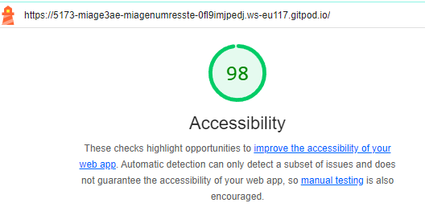

# Q1: Quels sont les arguments que vous pouvez utiliser pour convaincre votre Client de rendre son quizz accessible ? (Vous pouvez vous aider du cour)
Réponse: Rendre un quizz accessible permet de garantir l’inclusion et l’égalité des chances pour les personnes en situation de handicap, de respecter les obligations légales et normatives (WCAG, RGAA), de limiter les risques de sanctions financières, tout en élargissant la base d’utilisateurs potentiels, en améliorant l’expérience utilisateur (UX) et la compatibilité avec les technologies d’assistance.

# Q2: Ajouter le screen de votre score :
Screen: 

# Q3: Est-ce que l'analyse de Lighthouse est suffisante pour évaluer l'Accessibilité de votre Application ?
Réponse: Lighthouse est un bon point de départ pour détecter les erreurs d’accessibilité évidentes, mais il ne permet pas de garantir une accessibilité totale. Pour être conforme aux normes WCAG 2.1 et RGAA, il faut compléter l’audit par des tests manuels, des tests avec des outils spécialisés et des contrôles de compatibilité avec les lecteurs d’écran.

# Q4: Combien de fois vous devez utiliser une touche du clavier pour passer le quizz ?
Réponse: On doit utiliser environ 23 fois la touche tab pour accéder aux éléments du questionnaire et faire entrée plusieurs fois. C'est beaucoup ...

# Q5: Donner 3 roles ARIA et 3 propriété ARIA
Réponse: Les rôles ARIA tels que button (pour transformer un élément en bouton interactif), alert (pour signaler un message prioritaire) et dialog (pour indiquer une boîte de dialogue modale) permettent d’améliorer la compréhension des interfaces par les lecteurs d’écran, tandis que les propriétés ARIA comme aria-label (pour fournir une description alternative), aria-hidden (pour masquer un élément des technologies d’assistance) et aria-expanded (pour indiquer l’état d’expansion d’un menu ou d’un accordéon) offrent des indications supplémentaires sur l’état et le comportement des composants interactifs.

# Q6: Ajouter le screen de votre score Lighthouse
Screen: 

# Q7: L'une des best practice de l'ARIA est "ne pas utiliser l'ARIA" pouvez nous expliquer pourquoi d'après vous ?
Réponse: Les balises HTML natives (<button>, <a>, <input>, etc.) sont déjà bien prises en charge par les lecteurs d’écran et les technologies d’assistance. Ces balises possèdent par défaut des rôles et des propriétés implicites. 
Par exemple :
- Un bouton (<button>) est automatiquement perçu comme un role=“button” par les lecteurs d’écran.
- Un lien (<a>) est automatiquement identifié comme un role=“link”.
- Une case à cocher (<input type="checkbox">) est déjà reconnue comme un composant interactif.

Si on commence à ajouter des rôles ARIA sur ces balises, on risque de redéfinir inutilement le rôle natif de l’élément, ce qui peut confondre les lecteurs d’écran.

# Q8: Ajouter le screen de votre score Lighthouse
Screen:

# Q9: Pourquoi le score de lighthouse n'a pas augmenté d'après vous ?
Réponse: Du coup ca a augmenté haha.

# Q10: Quel est la valeur du rapport de contraste actuel :
Réponse: J'ai une valeur de 2.38 actuellement.

# Q11: Quel est la valeur du score AA :
Réponse: La valeur pour AA est de 4.5.

# Q12: Quel est la valeur du score AAA :
Réponse: La valeur pour AAA est de 7.

# Q13: Comment pouvez vous changer la valeur du contraste de votre texte ?
Réponse: On peut par exemple faire de la manière suivante pour un élément :
color: #000000; /* Couleur du texte en noir */
background-color: #FFFFFF; /* Fond blanc */
Cela va augmenter la valeur de contraste de l'élément.

# Q14: Ajouter le screen de votre score Lighthouse
Screen: 

En vrai le score n'a pas changé mais franchement c'est plus lisible je trouve !!

J'ai mis un petit screen du score de contraste d'un élément, c'est pas mal !!

# Q15: Êtes vous capable de déterminer visuellement ce qui est un lien ou pas en appliquant chaque altérations ?
Réponse: Quasiement, mais il manque quelques trucs pour que ce soit très clair. Par exemple, le "cliquer ici" il faudrait le souligner sinon on ne voit pas vraiment que c'est un URL.

# Q16: Ajouter le screen de votre score Lighthouse
Screen:

# Q17:  Proposition 1
Description:
Nb d'actions gagnée : 

# Q18:  Proposition 2
Description:
Nb d'actions gagnée : 

# Q19:  Proposition 3
Description:
Nb d'actions gagnée : 
