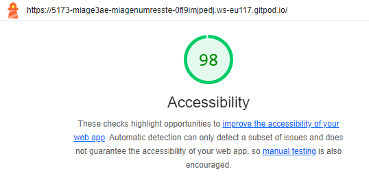

# Q1: Quels sont les arguments que vous pouvez utiliser pour convaincre votre Client de rendre son quizz accessible ? (Vous pouvez vous aider du cour)
Réponse: La rendre accessible aussi par les handicapés

# Q2: Ajouter le screen de votre score :
Screen: 

# Q3: Est-ce que l'analyse de Lighthouse est suffisante pour évaluer l'Accessibilité de votre Application ?
Réponse: Non, voici prq : Incapacité à détecter des problèmes complexes, Tests basés uniquement sur des règles, Absence d'évaluation humaine, Portée limitée

# Q4: Combien de fois vous devez utiliser une touche du clavier pour passer le quizz ?
Réponse: 22

# Q5: Donner 3 roles ARIA et 3 propriété ARIA
Réponse: button, alert, dialog & aria-label, aria-hidden, aria-expanded

# Q6: Ajouter le screen de votre score Lighthouse
Screen: 

# Q7: L'une des best practice de l'ARIA est "ne pas utiliser l'ARIA" pouvez nous expliquer pourquoi d'après vous ?
Réponse: 
L'une des meilleures pratiques de l'ARIA est "ne pas utiliser l'ARIA" lorsqu'elle n'est pas nécessaire, car :

HTML natif est suffisant : Les balises HTML sémantiques (comme <button> ou <header>) ont déjà des rôles ARIA implicites.
Réduction des erreurs : Mal utiliser l'ARIA peut causer des conflits avec les technologies d'assistance.
Simplicité et maintenance : Utiliser HTML sémantique rend le code plus simple, lisible et facile à maintenir.

On utilise ARIA uniquement lorsque le HTML standard ne peut pas répondre aux besoins d'accessibilité.

# Q8: Ajouter le screen de votre score Lighthouse
Screen: 

# Q9: Pourquoi le score de lighthouse n'a pas augmenté d'après vous ?
Réponse: Peut etre des problèmes d'accessibilité restants ??

# Q10: Quel est la valeur du rapport de contraste actuel :
Réponse: 

# Q11: Quel est la valeur du score AA :
Réponse: 3.0

# Q12: Quel est la valeur du score AAA :
Réponse: 4.5

# Q13: Comment pouvez vous changer la valeur du contraste de votre texte ?
Réponse: Utiliser la couleur #00f0a5

# Q14: Ajouter le screen de votre score Lighthouse
Screen: 

# Q15: Êtes vous capable de déterminer visuellement ce qui est un lien ou pas en appliquant chaque altérations ?
Réponse: Non

# Q16: Ajouter le screen de votre score Lighthouse
Screen: 

# Q17:  Proposition 1
Description: 
    Ajouter un mécanisme pour déplacer automatiquement le focus vers les propositions (
) après qu'une réponse ait été soumise. Cela réduit le besoin pour l'utilisateur de naviguer manuellement au clavier jusqu'à cette section, en assurant une transition fluide et accessible.
    L'ajout de l'attribut tabindex="-1" au conteneur des propositions permet de cibler cet élément pour y positionner le focus. Ensuite, un appel à document.getElementById('proposals').focus() garantit que les utilisateurs du clavier ou des lecteurs d'écran sont directement dirigés vers les propositions.
Nb d'actions gagnée : 
    1 à 2 actions clavier par question (tabulation pour naviguer jusqu'à la section des propositions).
    Sur un quiz de 10 questions, cela représente une économie de 10 à 20 interactions clavier.

# Q18:  Proposition 2
Description:
    Mettre en place un raccourci clavier (Espace) pour permettre à l'utilisateur de déplacer automatiquement le focus vers la section du quiz dès le chargement de la page. Cela améliore l'accessibilité en réduisant la nécessité pour l'utilisateur de naviguer manuellement à l'aide de la touche "Tab" ou d'autres interactions.
Nb d'actions gagnée : 
    1 action par utilisateur au début du quiz, car ils n'auront pas besoin de tabuler plusieurs fois pour atteindre la section du quiz. Si plusieurs utilisateurs utilisent fréquemment la fonctionnalité, cela pourrait représenter un gain significatif dans un contexte répétitif.

# Q19:  Proposition 3
Description:
Nb d'actions gagnée : 
